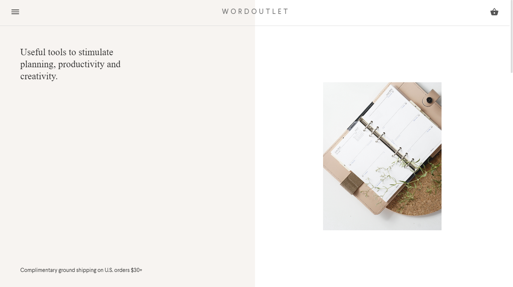

## WORDOUTLET - ECOMMERCE MERN Application

### About

The design and interface was inspired by the Harrnish YouTube codegrid channel, at that moment I was interested in creating a simple online store and chose this as a template (the original html template is in the original folder)

### Project Structure

In the process, I tried to design a fairly simple and intuitive code, assuming its possible census (I often practice this), in the end, as I believe, I achieved this result as follows:

#### Backend & Server

The server consists of a number of folders, these are routes and models, that is, the standard MVC, all possible actions with the http protocol were transferred to the routes folder, the models eventually became really small, since at that time I did not consider working with analytics, tracking the user, I wanted to understand more what an online store is from my own experience

#### Frontend & Client

For the client, I tried to completely divide the project into modules (components), since I wanted to minimize the time for the subsequent development of the remaining pages, and in reality the gain in time was significant, if the main page, where basically all the components were located, then the rest of the pages based on these components created in minutes. The client is absolutely simple - it is a folder of components and project pages.

### Links

- Project live - http://wordoutlet.herokuapp.com
- Codegrid channel - https://www.youtube.com/channel/UC7pVho4O31FyfQsZdXWejEw